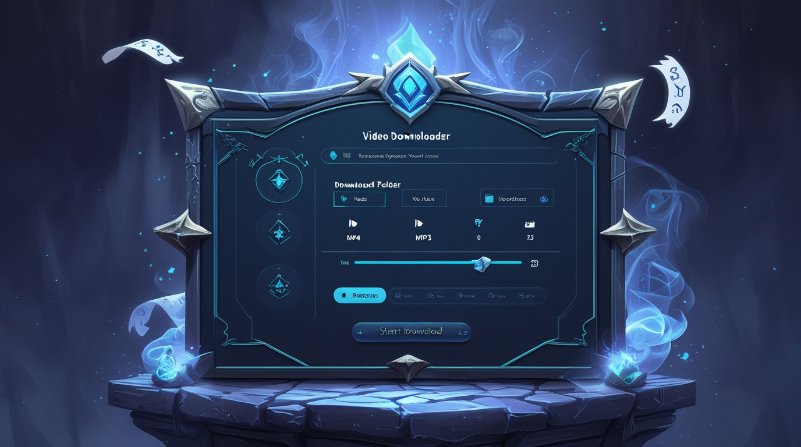

# 🧙‍♂️ WizVid - Fantasy Themed Video Downloader

WizVid is a powerful and visually enchanting video downloader designed with a dark fantasy-themed GUI. It leverages the capabilities of `yt-dlp` and `ffmpeg` to download and convert videos from a variety of platforms including YouTube. Whether you're saving lectures, songs, or full HD videos, WizVid makes the process feel like magic.



---

## ✨ Features

* 🎭 **Fantasy UI**: Immersive magical interface that feels straight out of a fantasy realm.
* 📅 **Video & Audio Downloads**: Download videos as MP4 or extract audio as MP3 effortlessly.
* 📁 **Choose Download Location**: Select custom folders for saving files.
* 🔺 **Format Options**: Switch between various formats with ease.
* 📊 **Progress Tracker**: Real-time download and conversion progress display.
* 🌫️ **Fade-In Animation**: Smooth UI transitions to enhance visual experience.

---

## 🛠️ Built With

* **Python**
* **PyQt6** – GUI design
* **yt-dlp** – Video downloading
* **ffmpeg** – Format conversion

---

## 🚀 Getting Started

### 🔧 Prerequisites

Ensure you have the following installed:

* Python 3.8+
* `ffmpeg`
* `yt-dlp`

### 📦 Installation

```bash
git clone https://github.com/khrizve/Video_Downloader.git
cd wizvid
pip install -r requirements.txt
```

### ▶️ Run the Application

```bash
python wizvid_src.py
```

---

## 🎨 Design Philosophy

WizVid doesn't just download media — it creates a user experience. Inspired by magical realms, the UI makes the user feel like a digital sorcerer. The fantasy theme is designed to enchant tech-savvy users who appreciate a bit of style with their utility.

---

## 🧙 Future Features

* 📜 Download history tracking
* 🧩 Plugin system for more sources
* 🔍 Video preview before download
* 🗣️ Voice-command support (via Luna integration)

---

## 🤝 Contributing

Contributions are welcome! Feel free to fork the repo and submit pull requests.

---

## 🌐 Connect

* 🧠 Author: Sorcerer
* 🕊️ Twitter: [Kh Rizve](https://x.com/rizve_19)
* 💼 Portfolio: [Sorcerer](https://rizve.netlify.app/)

---

> “Wield the wand of yt-dlp and the blade of ffmpeg. Download like a wizard.”
